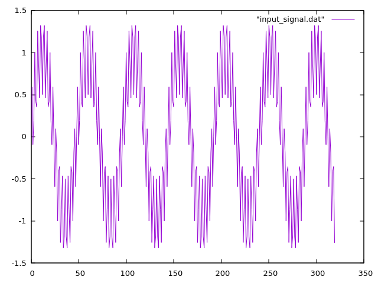
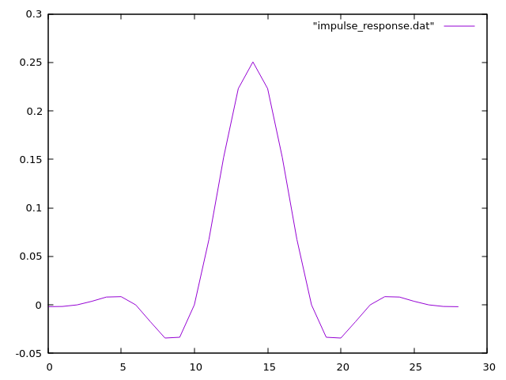
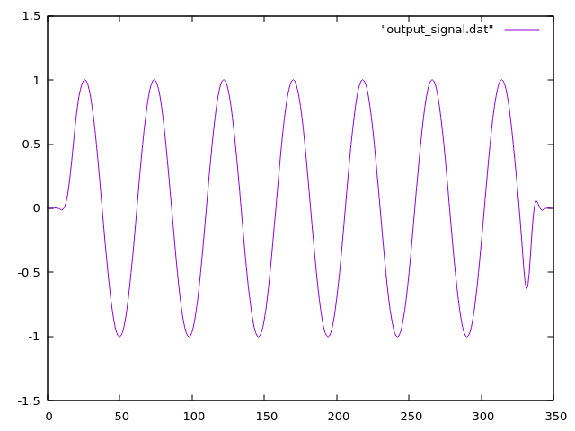
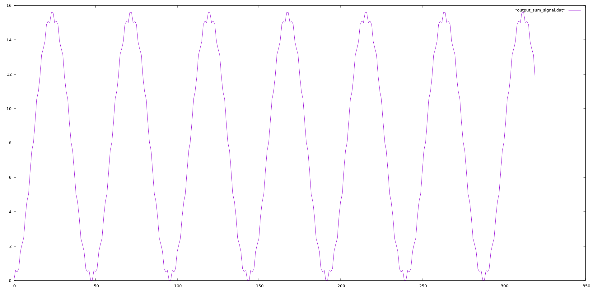

# DSP in C

Implementation of various DSP algorithms in C. The goal is to provide a simple and efficient implementation of common DSP algorithms that can be used in real-time applications.

## Convolution

Plot images using `gnuplot`, Input signal:

Filter response impulse:

Output signal:

Output signal using runnig sum:

> Note: This is taken from a UDEMY Course.
